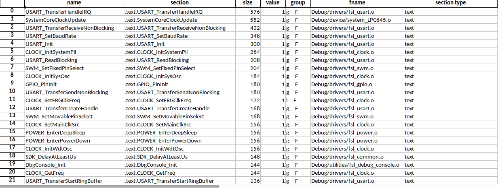

# object-symbols-parser

A command-line tool that reads symbol tables from object files and generates a sorted spreadsheet report
of symbols. This is especially useful in embedded development when optimizing code size and memory usage
is critical.

## Usage
### Object File
If your binary fails to compile due to code space constraints, this tool helps
you identify large symbols by reading one or more object files and generating a
sorted symbol table spreadsheet.

```bash
object_symbols_parser -f src/FileSystem.o -f src/cpp_config.o -f src/main.o -o /tmp/out.xlsx
```

### ELF/AXF File
You can also provide a single ELF or AXF binary file:

```{bash}
object_symbols_parser -f project.axf -o /tmp/out.xlsx
```

## Output
The tool aggregates symbol information into a Pandas DataFrame and writes it to an Excel .xlsx file.
By default, the symbols are sorted by section type and size, so you can quickly identify the
largest entries consuming your code or data space.



## Requirements
+ Python packages: click, pandas
+ GNU Binutils (objdump must be installed and in your system path or toolchain directory)
